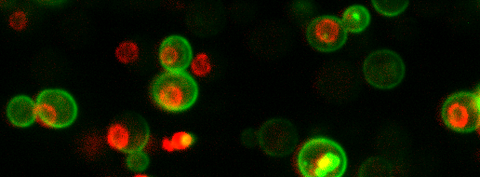

# Quantification of changes in protein localization for single cell images

The following repository contains the code, sample data sets, and work flow for measuring changes in protein-GFP subcellular localization as described in:

### Phenotypic heterogeneity in the DNA replication stress response revealed by quantiative protein dynamics measurements

## Required Software
Python 3.6+
R 4.2 +

## Running localizationQuantification.py 
1. First, run the **localizationQuantification.py**. It is important to ensure that the paramters are correct for the locations of the segmentation and image files. This is in the acquireMetadata module/function. 

*Current version of the code requires manual changes to AcquireMetadata module and functions to appropriately extract text  with regular expression. Future versions will hopefully make this more universal*

2. The output of the localizationQuantification.py will be a **.csv** file. These are the single cell localization values (LOC), where each row represents an individual cell. Each row will have the associated treatment and protein identities.

3. Use the **.csv** file that you named and saved in the **localizationAnalyses.py** module. This will, at a minimum, plot your heatmap and cluster your results. You can choose to analyze the data with your own code. 

## Additional & contact information

Feel free to [contact me](brandon.ho@mail.utoronto.ca) for questions, requests, etc. An interactive / GUI version is in the works for small-scale image analyses. 